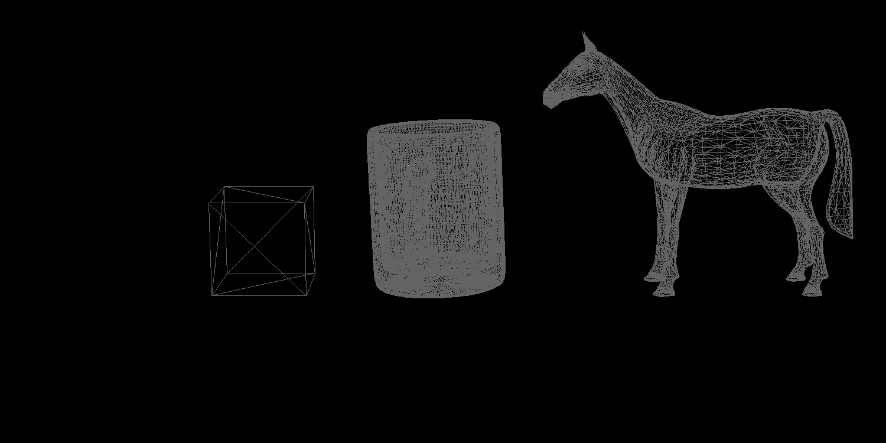

# CENG477

Repository that contains all of the course related work (i.e. programming assignments) that are done through the **CENG477 - Introduction to Computer Graphics** course.

## [Homework 1](/Homework1)

## [Homework 2](/Homework2)
The aim of this asignment is to implement Modeling Transformation, Viewing Transformation,
and Rasterization stages of the Forward Rendering Pipeline.
 
* At the first stage, the modeling transformations had been implemented which constructed the tiny little pixels in the image given below which represents the vertices:

* Then, we switched to the implementation of the Rasterization stage. The Midpoint algorithm had been implemented for this purpose. This algorithm is used to draw the lines which combines the vertices that are shown in the image above. 

The results of the algorithm for the empty box scene is given below:

Also, the image below represents the results of the algorithm for the horse and mug scene:

